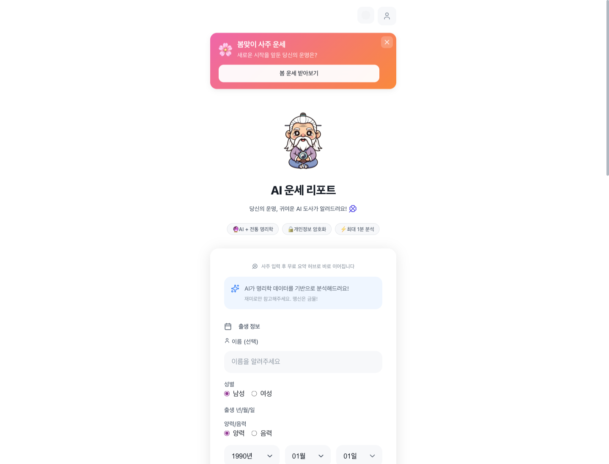
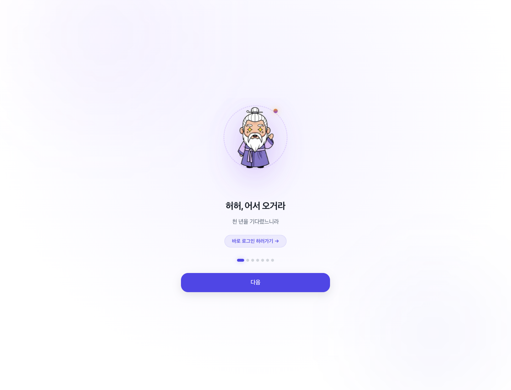
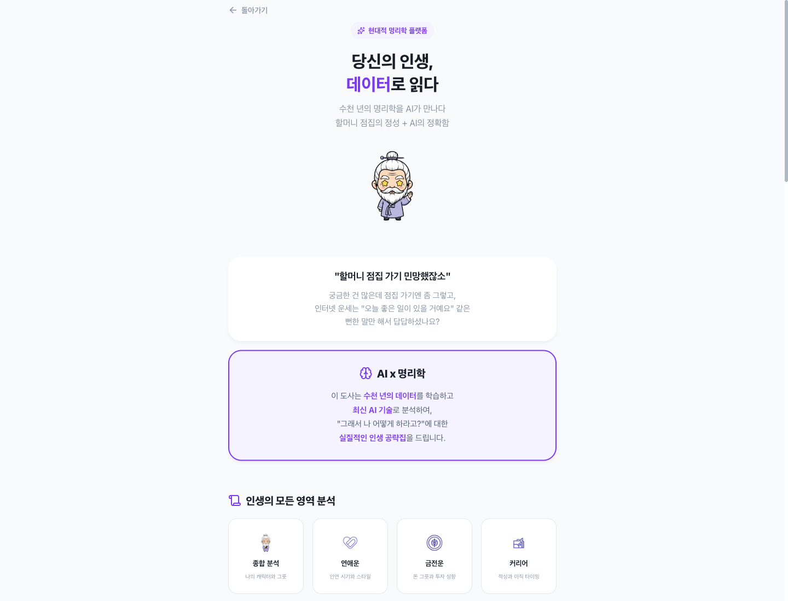

<div align="center">


# My Saju · 마이사주

**AI 도사가 풀어주는 나만의 사주 이야기**

생년월일과 태어난 시간만 있으면, 전통 명리학 해석을 현대적인 웹 UX로 만나볼 수 있는 AI 사주 분석 애플리케이션입니다.

[](./LICENSE)
[](https://nextjs.org/)
[](https://fastapi.tiangolo.com/)
[](https://supabase.com/)
[](https://www.typescriptlang.org/)
[](https://www.python.org/)

</div>

---

## 미리보기

<div align="center">



</div>

| 온보딩 | 서비스 소개 |
| :---: | :---: |
|  |  |

---

## ✨ 주요 기능

- 🔮 **AI 사주 해석** — OpenAI, Google Gemini, Anthropic provider 연동 구조를 통해 사주 분석 결과를 자연스러운 리포트로 제공합니다.
- 🗓️ **생년월일/출생시간 기반 분석** — 출생 정보로 사주 데이터를 계산하고 요약 허브와 탭별 해석을 구성합니다.
- 👤 **Kakao/Naver OAuth 로그인** — 소셜 로그인, 마이페이지, 저장 프로필 흐름을 포함합니다.
- 🧾 **Supabase PostgreSQL + RLS** — 사용자 데이터, 결제, 공유, 분석 테이블을 RLS 기반으로 보호합니다.
- 💳 **TossPayments 결제 연동** — 충전형 포인트와 유료 해석 결제 플로우를 지원합니다.
- 📤 **공유 링크와 데일리 기능** — 공유 리포트, 데일리 운세, 미션, 알림 확장 구조를 포함합니다.

## 🧱 기술 스택

| 영역 | 기술 |
|------|------|
| Frontend | Next.js 16, React 19, TypeScript, CSS Modules |
| Backend | FastAPI, Python 3.11, Pydantic v2 |
| Database | Supabase PostgreSQL |
| Auth | Kakao/Naver OAuth, JWT |
| Payment | TossPayments |
| AI | OpenAI, Google Generative AI, Anthropic |
| Saju engine | `sajupy`, `yijing-bazi-mcp` |

## 📁 프로젝트 구조

```text
frontend/              # Next.js App Router frontend
backend/               # FastAPI backend
supabase/migrations/   # Supabase/PostgreSQL schema migrations
Dockerfile             # Optional backend container image
```

## 사전 준비

- Python 3.11+
- Node.js 20+ 권장
- Supabase 프로젝트
- 사용할 LLM provider API key 중 하나 이상
- 선택: Kakao/Naver OAuth 앱, TossPayments 테스트/라이브 키, Redis, Telegram bot

## 🚀 빠른 시작

### 1. 저장소 준비

```bash
git clone git@github.com:hichoe95/open-saju-kr.git
cd open-saju-kr
```

### 2. 백엔드 설정

```bash
cd backend
python -m venv venv
source venv/bin/activate
pip install -r requirements.txt
npm install
cp .env.example .env
```

`backend/.env`를 열어 본인 프로젝트의 API 키와 URL을 입력합니다. `npm install`은 `bazi_runner.js`가 사용하는 `yijing-bazi-mcp` 의존성을 설치하기 위해 필요합니다.

백엔드 실행:

```bash
uvicorn app.main:app --reload --port 8003
```

API 문서: http://localhost:8003/docs

### 3. 프론트엔드 설정

새 터미널에서 실행합니다.

```bash
cd frontend
npm install
cp .env.local.example .env.local
npm run dev
```

앱 접속: http://localhost:3000

## 🔑 환경 변수

실제 키는 절대 커밋하지 마세요. 예시 파일을 복사한 뒤 각자 발급받은 값을 입력합니다.

| 위치 | 복사 명령 |
|------|-----------|
| Backend | `cp backend/.env.example backend/.env` |
| Frontend | `cp frontend/.env.local.example frontend/.env.local` |
| E2E tests | `cp frontend/e2e/.env.example frontend/.env.e2e` |

### 백엔드 주요 변수

| 변수 | 설명 |
|------|------|
| `ENV` | `development`, `test`, `production` 중 하나 |
| `OPENAI_API_KEY`, `GOOGLE_API_KEY`, `ANTHROPIC_API_KEY` | 사용할 LLM provider 키 |
| `JWT_SECRET_KEY` | 32자 이상 랜덤 문자열. 예: `openssl rand -hex 32` |
| `DATA_ENC_KEY_V1` | 개인정보 암호화 키. base64 디코딩 결과가 32바이트여야 합니다. 예: `openssl rand -base64 32` |
| `SUPABASE_URL` | Supabase 프로젝트 URL |
| `SUPABASE_ANON_KEY` | Supabase anon key |
| `SUPABASE_SERVICE_ROLE_KEY` | 백엔드 전용 service role key. 프론트엔드에 넣지 마세요 |
| `KAKAO_CLIENT_ID`, `KAKAO_CLIENT_SECRET` | Kakao OAuth 앱 정보 |
| `NAVER_CLIENT_ID`, `NAVER_CLIENT_SECRET` | Naver OAuth 앱 정보 |
| `OAUTH_REDIRECT_ALLOWLIST`, `OAUTH_REDIRECT_URI_ALLOWLIST` | 허용할 OAuth redirect origin/URI 목록 |
| `BACKEND_URL`, `FRONTEND_URL` | 백엔드/프론트엔드 공개 URL |
| `CORS_ORIGINS` | 프론트엔드 origin 목록 |
| `TOSS_TEST_SECRET_KEY`, `TOSS_TEST_CLIENT_KEY` | TossPayments 테스트 키 |
| `TOSS_LIVE_SECRET_KEY`, `TOSS_LIVE_CLIENT_KEY` | 선택: TossPayments 라이브 키 |
| `REDIS_URL` | 선택: 분산 rate limiting/캐시용 Redis |
| `TELEGRAM_BOT_TOKEN`, `TELEGRAM_CHAT_ID` | 선택: 운영 알림용 Telegram 설정 |

### 프론트엔드 주요 변수

| 변수 | 설명 |
|------|------|
| `NEXT_PUBLIC_API_URL` | 백엔드 API URL. 로컬 기본값은 `http://localhost:8003` |
| `NEXT_PUBLIC_SITE_URL` | 공개 사이트 URL. 로컬 기본값은 `http://localhost:3000` |
| `NEXT_PUBLIC_AUTH_MODE` | 인증 모드. 기본값 `dual` |
| `NEXT_PUBLIC_APP_NAME` | 앱 이름 |
| `NEXT_PUBLIC_COMPANY_NAME`, `NEXT_PUBLIC_REPRESENTATIVE_NAME` | 공개 페이지에 표시할 사업자/대표자 정보 |
| `NEXT_PUBLIC_BUSINESS_NUMBER`, `NEXT_PUBLIC_MAIL_ORDER_NUMBER` | 공개 페이지에 표시할 사업자/통신판매 정보 |
| `NEXT_PUBLIC_BUSINESS_ADDRESS`, `NEXT_PUBLIC_CONTACT_EMAIL`, `NEXT_PUBLIC_CONTACT_PHONE` | 공개 연락처 정보 |
| `NEXT_PUBLIC_VAPID_PUBLIC_KEY` | 선택: Web Push 공개 키 |
| `NEXT_PUBLIC_TOSS_CLIENT_KEY` | 선택: TossPayments 공개 client key |

`NEXT_PUBLIC_*` 값은 브라우저에 노출됩니다. secret key, service role key, OAuth secret, LLM API key는 절대 `NEXT_PUBLIC_*` 변수에 넣지 마세요.

## Supabase 설정

1. Supabase 프로젝트를 생성합니다.
2. `supabase/migrations/`의 SQL 마이그레이션을 순서대로 적용합니다.
3. Supabase project URL, anon key, service role key를 `backend/.env`에 입력합니다.
4. 금융/관리 RPC는 service role을 사용하는 백엔드에서만 호출해야 합니다.

Supabase CLI를 사용하는 경우 프로젝트를 연결한 뒤 마이그레이션을 적용합니다.

```bash
supabase link --project-ref <your-project-ref>
supabase db push
```

CLI를 쓰지 않는 경우 Supabase SQL Editor나 별도 migration 도구로 `supabase/migrations/*.sql`을 timestamp 순서대로 적용하세요.

## OAuth 설정

로컬 개발 기본 origin은 `http://localhost:3000`입니다. 배포 시 Kakao/Naver 개발자 콘솔에 실제 callback URL을 등록하고 백엔드 `.env`의 allowlist를 갱신하세요.

```bash
OAUTH_REDIRECT_ALLOWLIST=http://localhost:3000,https://your-domain.example
OAUTH_REDIRECT_URI_ALLOWLIST=http://localhost:3000,https://your-domain.example
```

## 결제 설정

TossPayments 키는 백엔드 `.env`에 입력합니다. secret key는 서버에서만 사용하고, 프론트엔드에는 공개 client key만 넣습니다.

- 테스트 환경: `TOSS_TEST_SECRET_KEY`, `TOSS_TEST_CLIENT_KEY`
- 라이브 환경: `TOSS_LIVE_SECRET_KEY`, `TOSS_LIVE_CLIENT_KEY`
- 프론트엔드 공개 키: `NEXT_PUBLIC_TOSS_CLIENT_KEY`

결제를 사용하지 않을 경우 관련 키를 비워둔 상태로 다른 기능을 먼저 실행할 수 있습니다. 결제 API는 키가 없으면 설정 오류를 반환합니다.

## Docker로 백엔드 실행하기

루트 `Dockerfile`은 백엔드 FastAPI 컨테이너용 최소 예시입니다.

```bash
docker build -t my-saju-backend .
docker run --env-file backend/.env -p 8003:8003 my-saju-backend
```

주의: 현재 Dockerfile은 Python 의존성 설치와 FastAPI 실행에 초점을 둔 최소 구성입니다. `yijing-bazi-mcp` 기반 `bazi_runner.js`까지 컨테이너에서 사용하려면 Node.js와 backend npm 의존성 설치 단계를 Dockerfile에 추가해야 합니다.

## 테스트와 검증

### 백엔드

```bash
cd backend
source venv/bin/activate
python -m pytest test_app.py -v
python -m pytest tests/test_payment.py -v
python test_saju_libs.py
```

전체 백엔드 테스트를 실행하려면 다음을 사용합니다.

```bash
python -m pytest -q
```

### 프론트엔드

```bash
cd frontend
npm run lint
npm run build
npm run test:marketing
```

E2E 테스트를 실행하려면 Playwright 브라우저를 설치하고 필요한 인증 환경변수를 설정합니다.

```bash
cd frontend
npm run e2e:install
cp e2e/.env.example .env.e2e
npm run e2e
```

## 보안 및 오픈소스 주의사항

- `.env`, `.env.local`, 로그, 가상환경, `node_modules`, 빌드 산출물은 Git에 포함하지 않습니다.
- `SUPABASE_SERVICE_ROLE_KEY`, Toss secret key, OAuth secret, LLM API key는 서버에서만 사용합니다.
- 실제 개인정보, 사업자 정보, 개인 이메일/전화번호는 배포자 본인의 `NEXT_PUBLIC_*` 환경변수로 주입합니다.
- 공개 전에는 Gitleaks, TruffleHog 같은 secret scanner로 현재 파일과 Git 히스토리를 별도로 점검하세요.
- 이미 노출된 키가 있다면 저장소 정리보다 먼저 provider 콘솔에서 폐기하고 새 키를 발급하세요.

## ⚠️ 면책 조항

- 이 프로젝트의 사주 분석, 운세, 궁합, 조언, AI 응답은 엔터테인먼트 및 참고용 정보입니다.
- 제공되는 결과는 의학, 법률, 금융, 투자, 심리상담, 직업 선택 등 전문적 의사결정을 대체하지 않습니다.
- 사용자는 본 프로젝트와 그 결과물을 자신의 책임하에 사용해야 하며, 중요한 결정이 필요한 경우 관련 분야의 자격 있는 전문가와 상담해야 합니다.
- 프로젝트 기여자와 배포자는 본 소프트웨어 또는 분석 결과의 사용으로 인해 발생하는 손해, 손실, 분쟁에 대해 책임을 지지 않습니다.

## 📄 라이선스

MIT License. 자세한 내용은 `LICENSE` 파일을 확인하세요.
